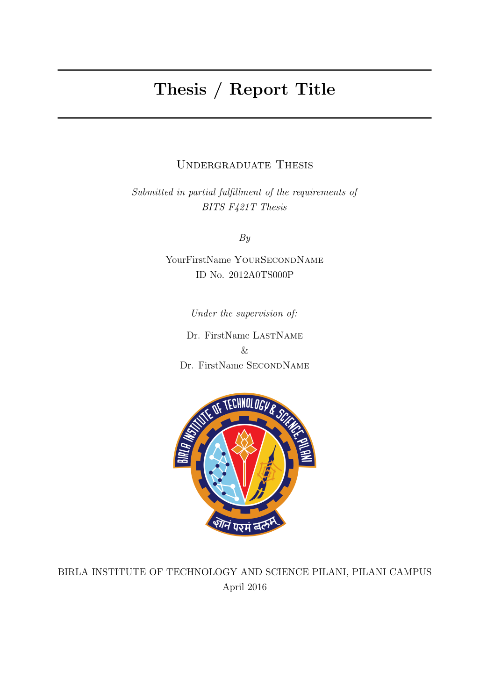

BITS Pilani Reports LaTeX Template
=======================

A template and style file for generating reports in LaTeX. It is designed keeping a BITSian's thesis in mind but can be extended by anyone to adapt to the needs of the respective university reports (project reports, PhD Thesis, etc).

The title page looks like this -




Improvements -

- The BITS Logo is now vectorized (taken from the BITS Branding Styleguide)
- The template design (configured in ```Thesis.cls```) adheres to the required thesis design for 2016 (according to the official handout)
- Support for ```biblatex``` instead of the existing ```natbib``` for added functionality

BITS Pilani, Pilani Campus Thesis template
By - Siddhant Shrivastava

This thesis builds upon the BITS Pilani Thesis Class from Darshit Shah -
https://github.com/darnir/BPHC-LaTeX-Report-Class

This template is heavily based on the work of Steven Gunn and Sunil Patel

Steven Gunn - http://users.ecs.soton.ac.uk/srg/softwaretools/document/templates/

Sunil Patel - http://www.sunilpatel.co.uk/thesis-template/


<a rel="license" href="http://creativecommons.org/licenses/by-nc-sa/4.0/"></a><br /><span xmlns:dct="http://purl.org/dc/terms/" href="http://purl.org/dc/dcmitype/Text" property="dct:title" rel="dct:type">LaTeX Thesis Class File</span> by <a xmlns:cc="http://creativecommons.org/ns#" href="https://github.com/darnir/BPHC-LaTeX-Report-Class" property="cc:attributionName" rel="cc:attributionURL">Darshit Shah</a> is licensed under a <a rel="license" href="http://creativecommons.org/licenses/by-nc-sa/4.0/">Creative Commons Attribution-NonCommercial-ShareAlike 4.0 International License</a>.<br />Based on a work at <a xmlns:dct="http://purl.org/dc/terms/" href="http://www.latextemplates.com/template/masters-doctoral-thesis" rel="dct:source">http://www.latextemplates.com/template/masters-doctoral-thesis</a>.
